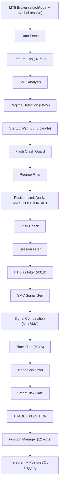

# XAUBot AI — Referensi Fitur

> **Versi:** v0.2.8 — *Predictive Recovery Intelligence*
> **Terakhir diperbarui:** 2026-05-30

## Gambaran Umum

XAUBot AI adalah bot *trading* XAUUSD (Emas) otomatis yang menggabungkan **XGBoost *Machine Learning***, **Smart Money Concepts (SMC)**, dan **Hidden Markov Model (HMM)** untuk deteksi *regime*. Bot ini beroperasi di MetaTrader 5 melalui *loop* Python asinkron, mengeksekusi *trade* pada *timeframe* M15 (15 menit).

Bot mengikuti *pipeline* yang ketat: setelah *startup* bot menjalankan **fase *warmup*** (menganalisa beberapa *candle* tanpa *trading*), lalu data diambil, fitur direkayasa, struktur pasar dianalisis, *regime* diklasifikasikan, prediksi ML dihasilkan, dan serangkaian *filter* berurutan menentukan apakah *trade* dieksekusi. Setelah posisi terbuka, kondisi *exit* dipantau setiap 5-10 detik, termasuk logika **pemulihan prediktif (*trajectory recovery*)** yang menahan posisi rugi jika model memprediksi pemulihan kuat.

> **Catatan revisi v0.2.x:** Strategi inti kembali menjadikan **SMC sebagai strategi utama**, dengan ML/XGBoost dan *Bias* H1 sebagai **pendukung** (tidak memblokir *trade*). Lihat bagian [Logika Exit Lanjutan](#logika-exit-lanjutan-v02x--predictive-recovery) dan [Konektivitas & Infrastruktur](#konektivitas--infrastruktur).

---

## Fase *Startup Warmup*

Sebelum *trading* dimulai, bot menjalankan **fase *warmup*** yang dapat dikonfigurasi (`STARTUP_WARMUP_LOOPS`, *default* **3 *candle* M15 ≈ 45 menit**).

- Selama *warmup*, bot **menganalisa pasar penuh** (data, fitur, *SMC*, *regime*, *ML*) tetapi **TIDAK mengeksekusi *trade***.
- *Counter* *warmup* (`_startup_candles`) **selalu mulai dari 0** setiap kali bot dijalankan — **tidak pernah** di-*restore* dari *state* lama, sehingga *restart* selalu menunggu indikator stabil terlebih dahulu.
- Tujuan: menghindari *entry* pada indikator yang belum stabil tepat setelah *restart*.

---

## *Pipeline Entry Filter*

*Filter* berjalan secara berurutan selama `_trading_iteration()`. Sebuah sinyal harus melewati **SEMUA** *filter* untuk mengeksekusi *trade*. Pemeriksaan **batas posisi** dilakukan **lebih awal** (sebelum analisa berat) untuk menghemat komputasi bila posisi sudah penuh.

### 1. Pengambilan Data
- Mengambil **200 *bar* M15** dari MetaTrader 5.
- Data dikonversi ke **Polars *DataFrame*** (bukan Pandas).

### 2. Rekayasa Fitur (*Feature Engineering*)
- Menghitung **37 fitur teknikal** dari data OHLCV.
- Meliputi: *RSI*, *ATR*, *MACD*, *Bollinger Bands*, *EMA* (berbagai periode), *Stochastic*, indikator berbasis volume, dan lainnya.
- Semua komputasi menggunakan Polars untuk performa.

### 3. Analisis *SMC*
- Mendeteksi struktur institusional *Smart Money Concepts*:
  - ***Order Block* (OB)** — zona *supply/demand* dari aktivitas institusional.
  - ***Fair Value Gap* (FVG)** — ketidakseimbangan dalam *price action*.
  - ***Break of Structure* (BOS)** — sinyal kelanjutan tren.
  - ***Change of Character* (CHoCH)** — sinyal pembalikan arah.

### 4. Deteksi *Regime*
- ***HMM* (*Hidden Markov Model*)** mengklasifikasikan kondisi pasar saat ini:
  - `TRENDING` — pergerakan searah, kondusif untuk *entry*.
  - `RANGING` — konsolidasi menyamping, ukuran posisi dikurangi.
  - `HIGH_VOLATILITY` — pergerakan tidak menentu, butuh kehati-hatian.
  - `CRISIS` — kondisi ekstrem, *trading* diblokir.

### 5. Pelindung *Flash Crash*
- Proteksi darurat: jika pergerakan harga melebihi ambang persentase tertentu, **semua posisi langsung ditutup**.
- Mencegah kerugian katastropik saat dislokasi pasar mendadak.

### 6. *Filter Regime*
- Memblokir *trading* sepenuhnya jika rekomendasi *regime* adalah `SLEEP`.
- Mencegah *entry* saat kondisi pasar tidak menguntungkan yang teridentifikasi oleh *HMM*.

### 7. Pemeriksaan Risiko
- Memblokir *trading* jika:
  - **Batas kerugian harian** telah tercapai (**3%** dari kapital, `MAX_DAILY_LOSS_PERCENT`).
  - ***Equity*** terlalu rendah relatif terhadap *margin* yang dibutuhkan.
  - **Batas kerugian total** telah dilanggar (10% dari kapital).

> **Batas Posisi (pemeriksaan awal):** Sebelum analisa berat, bot menghitung posisi terbuka aktual di MT5 (tanpa *filter magic number*, agar nama simbol broker yang berbeda tetap terdeteksi). Jika sudah mencapai `MAX_POSITIONS` (*default* **1**, dapat diubah di `.env`), *iterasi* langsung dibatalkan.

### 8. *Filter* Sesi
- Memfilter berdasarkan sesi *trading* **WIB (Waktu Indonesia Barat)**.
- Setiap sesi menerapkan ***lot size multiplier*** untuk mengontrol eksposur:
  - **Sydney** (06:00-13:00 WIB) — *multiplier* 0.5x (volatilitas rendah).
  - **Tokyo** (07:00-16:00 WIB) — *multiplier* 0.7x (volatilitas sedang).
  - **London** (15:00-24:00 WIB) — *multiplier* 1.0x (volatilitas tinggi).
  - **New York** (20:00-24:00 WIB) — *multiplier* 1.0x (volatilitas ekstrem).
  - ***Off-Hours*** (00:00-06:00 WIB) — **diblokir sepenuhnya**.

### 9. *Bias* H1 (#31B — Pendukung, v0.2.5)
- Konfirmasi *multi-timeframe* menggunakan ***EMA20* pada *chart* H1**.
- **Revisi v0.2.5:** *Bias* H1 kini berperan sebagai **pendukung (*confirmation*), BUKAN *blocker*** — *bias* tidak lagi membatalkan *trade* SMC yang valid, hanya menyesuaikan *confidence*/prioritas arah.
  - **BULLISH** (harga di atas *EMA20*) — mendukung sinyal *BUY*.
  - **BEARISH** (harga di bawah *EMA20*) — mendukung sinyal *SELL*; *override* H1 diturunkan ke ambang **SMC ≥ 70%** dan *filter SELL* memakai H1 saja.
  - **NEUTRAL** (harga dekat *EMA20*) — netral, tidak memblokir.
- Hasil *backtest* awal (saat masih *blocker*): **+$343, *win rate* 81.8%, *Sharpe* 3.97**.

### 10. Generasi Sinyal *SMC*
- Menghasilkan sinyal ***BUY* atau *SELL*** berdasarkan analisis struktur *SMC*.
- Setiap sinyal memiliki ***confidence score*** yang berasal dari kualitas struktur yang terdeteksi (kedekatan *OB*, keselarasan *FVG*, konteks *BOS*/*CHoCH*).

### 11. Kombinasi Sinyal
- Menggabungkan **sinyal *SMC* + prediksi *ML* (*XGBoost*)**.
- Menerapkan ***dynamic confidence threshold*** yang beradaptasi berdasarkan:
  - Sesi *trading* saat ini.
  - *Regime* pasar.
  - Volatilitas terkini.
- Kedua sinyal harus sepakat arah; *confidence* gabungan harus melampaui *threshold*.

### 12. *Filter* Waktu (#34A)
- Melewatkan jam WIB tertentu yang dikenal berkondisi buruk:
  - **Jam 9 WIB** — akhir sesi *New York*, likuiditas rendah.
  - **Jam 21 WIB** — transisi *London*-*New York*, rawan *whipsaw*.
- Hasil *backtest*: **+$356 peningkatan**.

### 13. *Cooldown Trade*
- Memberlakukan jeda minimum **150 detik (2.5 menit)** antara *trade* berturut-turut.
- Mencegah *overtrading* dan *entry* bertubi-tubi dari sinyal yang noisy.

### 14. Gerbang Risiko Cerdas (*Smart Risk Gate*)
- Gerbang terakhir sebelum eksekusi. Memeriksa:
  - **Mode *trading***: `NORMAL`, `RECOVERY`, `PROTECTED`, atau `STOPPED`.
  - **Perhitungan *lot size***: Berdasarkan *ATR*, mode kapital, dan *multiplier* sesi.
  - **Pengaman perangkat lunak (*software guard*)**: batas kerugian harian & *state*. (Jumlah posisi aktual sudah diperiksa lebih awal di [Pemeriksaan Risiko](#7-pemeriksaan-risiko); *default* `MAX_POSITIONS=1`.)
- Jika mode `STOPPED`, tidak ada *trade* yang dieksekusi terlepas dari kualitas sinyal.

---

## 12 Kondisi *Exit*

**12 kondisi *exit*** diperiksa setiap **5-10 detik** selama posisi terbuka.

### 1. *Take Profit* (TP Level Broker)
- *TP* dipasang di level broker saat *entry*.
- Dihitung menggunakan rasio *risk-reward* berbasis *ATR*.

### 2. *Trailing Stop* Berbasis USD (Progresif — selalu aktif)
- *Trailing stop* sederhana berbasis **dolar profit**, **tidak bergantung pada *ATR*** sehingga selalu aktif. Dikonfigurasi via `.env`:
  - `TRAIL_START_USD` (*default* **$3.0**) — mulai *trailing* saat profit ≥ nilai ini.
  - `TRAIL_DISTANCE_PIPS` (*default* **15 pips**, 1 pip = $0.1 pergerakan harga gold).
- **Progresif** — makin besar profit, makin ketat jarak *trail*-nya:
  - profit ≥ `TRAIL_START_USD` × 5 → sangat ketat (≈ 60% jarak, min 8 pips).
  - profit ≥ `TRAIL_START_USD` × 3 → ketat (≈ 75% jarak, min 10 pips).
  - profit ≥ `TRAIL_START_USD` → normal (jarak penuh).
- *SL* hanya digeser ke arah yang mengunci profit (BUY: naik saja; SELL: turun saja).
- Berjalan **sebelum** *trailing ATR* — bertindak sebagai pengaman profit dasar.

### 2b. *Trailing Stop* Adaptif *ATR* (#24B)
- ***Trailing stop* adaptif berbasis *ATR***:
  - Jarak aktivasi: ***ATR* x 4.0**.
  - Ukuran langkah: ***ATR* x 3.0**.
- Mengunci keuntungan seiring harga bergerak menguntungkan dalam kondisi tren.

### 3. Perpindahan *Breakeven* (#24B)
- Memindahkan *stop loss* ke **harga *entry*** (*breakeven*) saat keuntungan belum direalisasi melampaui ***ATR* x 2.0**.
- Menghilangkan risiko pada *trade* setelah pergerakan menguntungkan.

### 4. *Exit* Pembalikan *ML*
- Menutup posisi jika *confidence* model *ML* **berbalik arah** dengan *confidence* melebihi **75%**.
- Merespons perubahan kondisi pasar yang terdeteksi oleh *XGBoost*.

### 5. Kerugian Maksimal Per *Trade*
- ***Stop loss* level perangkat lunak** sebesar **1% dari kapital**.
- Berfungsi sebagai jaring pengaman di samping *SL* broker.

### 6. Batas Kerugian Harian
- Jika kerugian kumulatif harian mencapai **3% dari kapital** (`MAX_DAILY_LOSS_PERCENT`), **semua posisi ditutup** dan *trading* dihentikan untuk hari itu.

### 7. Batas Kerugian Total
- Jika kerugian kumulatif total mencapai **10% dari kapital**, ***trading* dihentikan sepenuhnya** sampai intervensi manual.

### 8. Penanganan Penutupan Pasar
- Sebelum penutupan harian atau penutupan akhir pekan:
  - Mengambil keuntungan pada posisi dengan *unrealized profit* **> $5**.
  - Mencegah risiko *gap* dari posisi yang terbawa semalam/akhir pekan.

### 9. Darurat *Flash Crash*
- Dipicu oleh pergerakan harga ekstrem secara tiba-tiba.
- **Langsung menutup semua posisi terbuka** tanpa penundaan.

### 10. Proteksi *Drawdown*
- Memantau *drawdown* dari puncak *equity*.
- Menutup semua posisi jika *drawdown* melebihi **50%** dari puncak.

### 11. *Impulse Trail* (#33B)
- *Trailing stop* yang ditingkatkan menggunakan **deteksi *impulse candle***.
- Mengidentifikasi *candle* momentum kuat dan men-*trail* *stop* di belakangnya.
- Lebih responsif dibanding *trailing ATR* standar dalam kondisi tren.

### 12. *Smart Breakeven* (#28B)
- Logika *breakeven* yang ditingkatkan dengan **pemicu *ATR multiplier***:
  - Pemicu: keuntungan melampaui ***ATR* x 2.0**.
  - Memindahkan *SL* ke *entry* + *buffer* kecil.
- Lebih adaptif dibanding *breakeven* berbasis pip tetap.

---

## Logika *Exit* Lanjutan (v0.2.x — *Predictive Recovery*)

Selain 12 kondisi di atas, *Smart Risk Manager* menerapkan logika *exit* prediktif yang diperkenalkan pada seri v0.2.5–v0.2.8 untuk **mengurangi *cut loss* prematur** saat model memprediksi pemulihan.

### *Trajectory Recovery Override* (v0.2.8)
- Memprediksi lintasan profit posisi ~1 menit ke depan.
- *Override* (menahan posisi) dipicu berbasis **jumlah pemulihan**, bukan profit absolut:
  - `recovery_amount = pred_1m − current_profit > $3` (prediksi membaik signifikan), **ATAU**
  - `pred_1m > −$2` (prediksi rugi kecil saja), **DAN**
  - *confidence* > **75%** **DAN** akselerasi momentum > **0.005** (dilonggarkan dari 0.01).
- Filosofi: *"pemulihan meski profit kecil dengan interval lama tidak apa-apa"* — bot menahan posisi rugi yang diprediksi pulih, alih-alih *cut* terlalu dini.

### *Golden Session* & *Golden Emergency* (v0.2.7)
- Selama **Golden Session** (*overlap* London–New York), batas *spread* dinaikkan **50 → 80 pips** agar tidak menolak *entry* saat volatilitas tinggi.
- *Golden Emergency* (rugi besar + durasi pendek + tidak pernah profit) tetap memotong posisi, **kecuali** sinyal *trajectory recovery* kuat memicu *override*.

### *Monotonic Loss Ratchet* & *Grace Period* (v0.2.5–v0.2.6)
- ***Monotonic loss ratchet*** — sekali kerugian melewati ambang tertentu, ambang *cut* tidak dilonggarkan lagi (mencegah "harap-harap cemas" yang memperdalam rugi).
- ***Grace period*** untuk *trade* yang **belum pernah profit** — diberi waktu toleransi sebelum dievaluasi *cut loss* (perbaikan unit & perhitungan *timestamp* di v0.2.6).
- *Trajectory hold* hanya berlaku untuk *trade* yang **pernah profit** (*ever-profitable*).

---

## Riwayat Optimasi *Backtest*

Rangkuman optimasi utama yang diterapkan ke bot *live*, diuji dan divalidasi melalui *backtest*.

| # | Nama | Perubahan Utama | Hasil |
|---|------|-----------------|-------|
| #24B | *ATR-Adaptive Exit* | *Trailing* berbasis *ATR* (4.0x) dan *breakeven* (2.0x) *multiplier* | Optimasi dasar untuk logika *exit* |
| #28B | *Smart Breakeven* | *Breakeven* yang ditingkatkan dengan pemicu *ATR* x 2.0 | Peningkatan waktu *exit* pada *trade* yang menang |
| #31B | *Filter* H1 *EMA20* | *Filter multi-timeframe* harga H1 vs *EMA20* | +$343, WR 81.8%, *Sharpe* 3.97 |
| #33B | *Impulse Trail* | *Trail* menggunakan deteksi *impulse candle* | *Trailing* lebih baik di pasar tren |
| #34A | Lewati Jam Tertentu | Lewati jam WIB 9 dan 21 | +$356, pengurangan kerugian *whipsaw* |

---

## Manajemen Risiko

### Mode Kapital

Mode kapital dikonfigurasi otomatis berdasarkan saldo akun. Setiap mode mengatur parameter risiko yang sesuai untuk ukuran akun.

| Mode | Rentang Kapital | Risiko/*Trade* | *Lot* Maks |
|------|----------------|----------------|------------|
| MICRO | < $500 | 2% | 0.02 |
| SMALL | $500 - $10,000 | 1.5% | 0.05 |
| MEDIUM | $10,000 - $100,000 | 0.5% | 0.10 |
| LARGE | > $100,000 | 0.25% | 0.50 |

### Mode *Trading*

*Smart Risk Manager* secara dinamis menyesuaikan mode *trading* berdasarkan performa terkini.

| Mode | Pemicu | Penyesuaian *Lot* |
|------|--------|-------------------|
| NORMAL | Kondisi *default* | *Lot* dasar (0.01-0.03) |
| RECOVERY | Setelah *trade* rugi | *Lot* pemulihan (0.01) |
| PROTECTED | Mendekati batas kerugian harian | *Lot* minimum (0.01) |
| STOPPED | Batas kerugian harian atau total tercapai | *Trading* tidak diizinkan |

### Batas Risiko

| Batas | Nilai | Aksi |
|-------|-------|------|
| Kerugian harian maks | **3%** dari kapital (`MAX_DAILY_LOSS_PERCENT`) | Tutup semua posisi, hentikan *trading* untuk hari itu |
| Kerugian total maks | 10% dari kapital | Hentikan semua *trading* sampai *reset* manual |
| Kerugian maks per *trade* | 1% dari kapital | *Stop loss* perangkat lunak |
| *SL* darurat broker | 2% dari kapital | *Hard stop* level broker |
| Posisi bersamaan maks | **1** (`MAX_POSITIONS`, *default* `.env`) | Tolak *entry* baru jika sudah di batas (diperiksa lebih awal) |

---

## *Filter* Sesi (WIB)

Semua waktu sesi dalam **WIB (Waktu Indonesia Barat, UTC+7)**.

| Sesi | Jam (WIB) | Volatilitas | *Multiplier Lot* |
|------|-----------|-------------|-------------------|
| Sydney | 06:00 - 13:00 | Rendah | 0.5x |
| Tokyo | 07:00 - 16:00 | Sedang | 0.7x |
| London | 15:00 - 24:00 | Tinggi | 1.0x |
| New York | 20:00 - 24:00 | Ekstrem | 1.0x |
| *Off-Hours* | 00:00 - 06:00 | N/A | **Diblokir** |

### *Golden Hour*
- **19:00 - 23:00 WIB** (*London*-*New York Overlap*).
- Periode likuiditas dan volatilitas tertinggi untuk XAUUSD.
- Kondisi *trading* terbaik; *multiplier lot* penuh diterapkan.

### Jam yang Dilewati (#34A)
- **Jam 9 WIB** — Akhir sesi *New York*; likuiditas rendah menyebabkan *fill* yang tidak menentu.
- **Jam 21 WIB** — Transisi *London*-*New York*; rawan *whipsaw* dan *false breakout*.

---

## *Auto-Trainer*

Bot menyertakan *pipeline* pelatihan ulang model otomatis untuk menjaga model *ML* tetap mutakhir dengan kondisi pasar.

| Parameter | Nilai |
|-----------|-------|
| Interval pemeriksaan | Setiap 20 *candle* (~5 jam pada M15) |
| Pelatihan ulang harian | 05:00 WIB (saat pasar tutup) |
| Pelatihan akhir pekan | Pelatihan mendalam dengan jendela data yang diperluas |
| *Threshold AUC* minimum | 0.65 |
| Kebijakan *rollback* | Jika model baru berkinerja lebih buruk, kembali ke *backup* |

### Alur Pelatihan Ulang
1. Setiap 20 *candle*, *auto-trainer* memeriksa metrik performa model.
2. Jika *AUC* turun di bawah **0.65**, pelatihan ulang dipicu.
3. Pada **05:00 WIB setiap hari** (pasar tutup), pelatihan ulang terjadwal berjalan.
4. Pada **akhir pekan**, pelatihan mendalam menggunakan *dataset* historis yang lebih besar.
5. Setelah pelatihan, model baru divalidasi terhadap model sebelumnya.
6. Jika model baru berkinerja lebih buruk, sistem **melakukan *rollback*** ke model *backup*.

---

## Model *ML*

### Algoritma
- ***XGBoost* *gradient-boosted decision trees***.

### Fitur
- **37 indikator teknikal** dihitung oleh `src/feature_eng.py`:
  - Tren: *EMA* (berbagai periode), *MACD*, *ADX*.
  - Momentum: *RSI*, *Stochastic K/D*.
  - Volatilitas: *ATR*, *Bollinger Bands* (*width*, *%B*).
  - Volume: Indikator berbasis volume.
  - Kustom: Fitur turunan *SMC*, fitur *regime*.

### Keluaran
- **Sinyal**: *BUY*, *SELL*, atau *HOLD*.
- ***Confidence score***: 0.0 hingga 1.0, digunakan dalam kombinasi dengan *confidence SMC*.

### *Threshold* Dinamis
- *Threshold confidence* untuk eksekusi *trade* tidak tetap.
- Menyesuaikan berdasarkan:
  - **Sesi**: *Threshold* lebih tinggi saat sesi volatilitas rendah.
  - ***Regime***: *Threshold* lebih tinggi saat *regime ranging*/*volatile*.
  - **Performa terkini**: Diperketat setelah kerugian, dilonggarkan setelah kemenangan.

---

## Ketahanan Model *ML* (v0.2.x)

Pelatihan *XGBoost* diperkuat agar tidak gagal pada data pasar yang tidak ideal:

- **Penanganan *NaN* fitur** — hanya kolom `target` yang wajib *non-null*; *NaN* pada fitur diisi 0 (bukan membuang seluruh baris).
- **Membuang fitur buruk** — kolom dengan **> 80% nilai *null*** otomatis di-*drop* sebelum pelatihan.
- **Eval kelas tunggal** — `eval_metric` utama diubah ke **`logloss`** (selalu valid). **`auc` hanya ditambahkan** bila *test set* berisi kedua kelas, mencegah *NaN* AUC pada jendela *time-series* berkelas tunggal.
- **Logging distribusi kelas** train/test untuk transparansi.
- **Pesan kegagalan spesifik** — *auto-trainer* melaporkan jumlah sampel valid bila *fit* gagal.

---

## Enrichment AI (Fase 1) — Telegram Notification Enrichment

**Baru di v0.2.9:** Integrasi LLM (Claude Haiku) untuk enrichment notifikasi Telegram dengan narasi makro kontekstual.

### Cara Kerja Fase 1 (Zero-Risk Enrichment)

1. **Setiap trade entry/exit**, Telegram notifikasi diminta enrichment dari LLM.
2. LLM menerima: sinyal SMC/ML reasoning + headline berita terkini (jika ada) + jadwal ekonomi hari ini.
3. LLM mengembalikan: **macro sentiment** (-1.0 bearish hingga +1.0 bullish) + narasi reasoning.
4. **Bot menambahkan** macro insight ke notification text tanpa mempengaruhi trade execution (zero impact).
5. User membaca di Telegram: sinyal teknikal + konteks makro → bisa manual override jika dirasa salah.

### Contoh Output (Telegram Notification)

**Sebelum (tanpa enrichment):**
```
✅ WIN #16282 | XAUUSD BUY
Entry: 2550.23 | Exit: 2551.45 | P/L: +$2.20
Duration: 45m | Lot: 0.01
```

**Sesudah (dengan enrichment):**
```
✅ WIN #16282 | XAUUSD BUY
Entry: 2550.23 | Exit: 2551.45 | P/L: +$2.20
Duration: 45m | Lot: 0.01

📊 Macro Context:
  Signal: SMC-ONLY FVG+BOS bullish, ML agree 72%
  Backdrop: Fed hawkish bias maintained → bearish for gold
  Combined: Sinyal berlawanan dengan fundamental, tapi SMC strength cukup untuk win
  Confidence: 65% technical, 35% macro hedge
```

### Konfigurasi

| Parameter | Nilai Default | Keterangan |
|-----------|---|---|
| `AI_PROVIDER` | (kosong) | Provider: `zai`, `deepseek`, `openrouter`, `openai`, `anthropic` |
| `AI_API_KEY` | (kosong) | API key sesuai provider yang dipilih |
| `AI_MODEL` | (kosong) | Model name (default per provider: glm-4, deepseek-chat, gpt-4o-mini, dll) |
| `AI_ENABLED` | `false` | Set `true` untuk aktifkan enrichment |
| Cache duration | 15 menit | Response di-cache per konteks untuk hindari API calls berlebih |
| Timeout | 5 detik | Jika LLM response > 5s, fallback ke neutral |
| Cost | ~$0.5-2/hari | Tergantung provider (Z.AI termurah ~$0.03/hari) |

### Provider Comparison

| Provider | Model | Cost/1M tokens | Latency | Akurasi | Rekomendasi |
|---|---|---|---|---|---|
| **Z.AI** | glm-4 | ~$0.3 | ~400ms | Tinggi | ✅ **TERBAIK** — murah & akurat |
| **DeepSeek** | deepseek-chat | ~$0.14 | ~300ms | Tinggi | ✅ Sangat murah, cepat |
| **OpenRouter** | deepseek/gpt-4o-mini | ~$0.1-1 | ~400ms | Tinggi | ✅ Fleksibel multi-model |
| OpenAI | gpt-4o-mini | ~$0.15 | ~500ms | Sangat tinggi | Mahal tapi akurat |
| Anthropic | claude-haiku | ~$0.80 | ~300ms | Sangat tinggi | Termahal tapi reliable |

**Saat ini (v0.2.9):** User config Z.AI (glm-4) — cost optimal untuk production.

### Fallback & Safety

- **API down atau timeout** → notifikasi tetap terkirim dengan text default (tanpa macro context)
- **Hallucination protection** → LLM output hanya informatif, TIDAK mengubah keputusan trading
- **Graceful degradation** → jika Anthropic API error, bot lanjut trading normal tanpa gangguan

---

## SL Learning Loop (v0.2.9) — Bot Belajar dari Stop Loss

**Baru di v0.2.9:** Bot tidak lagi "buta" terhadap hasil trade sendiri. Setiap SL yang kena dianalisa dan memicu ML retrain otomatis.

### Lapis 1: Deteksi & Logging Broker SL

**Masalah sebelumnya:** Posisi yang kena hard SL di MT5 broker hilang tanpa tercatat.

**Solusi (v0.2.9):**
- Method baru `MT5Connector.get_closed_deals()` — query MT5 trade history untuk deal yang ditutup broker
- Method baru `_detect_broker_closed_positions()` di main_live — berjalan setiap 10 iterasi (~10 detik)
- Identifikasi penyebab close: `BROKER_SL`, `BROKER_TP`, atau `BROKER_CLOSE`
- Log semua broker-closed positions ke `trade_logger` untuk tracking

**Efek:** Sekarang bot tahu kapan SL kena, profit/loss setiap SL dicatat, consecutive_losses dihitung dengan akurat.

### Lapis 2: ML Retrain Triggered by Consecutive SL

**Masalah sebelumnya:** Setelah 3 SL berturut-turut, hanya lot size yang dikurangi (RECOVERY mode). Model ML tetap tidak berubah.

**Solusi (v0.2.9):**
- Method baru `AutoTrainer.trigger_retrain(reason)` — retrain model on-demand (tidak tunggu 05:00 WIB)
- Di main_live: setelah `record_trade_result()`, jika `consecutive_losses >= 3` → **trigger immediate retrain**
- Retrain berjalan async (non-blocking) dengan reason `consecutive_sl_3`

**Flow:**
```
SL kena → record_trade_result() → consecutive_losses = 3
    ↓
trigger_retrain(reason="consecutive_sl_3")
    ↓
ML retrains dengan 15.000 bar M15 terbaru
    ↓
Model belajar dari 3 SL terakhir, adjust weights
    ↓
Next trade: ML lebih hati-hati (lebih takut kondisi serupa)
```

**Efek:** Win rate naik setelah consecutive SL karena model teradaptasi dengan market condition yang sedang tidak cocok.

### Lapis 3: AI SL Analysis — Narrative Diagnosis (v0.2.9)

**Fitur baru:** Setelah setiap SL, AI analisis **kenapa** SL terjadi dan kirim ke Telegram sebagai **informational enrichment**.

**Cara kerja:**
1. Setiap SL close → collect context: entry/exit price, duration, session, regime, signal strength
2. Kirim ke Z.AI/OpenRouter dengan prompt: "Analyze why this SL hit"
3. LLM return: `root_cause`, `avoidance_strategy`, `confidence_modifier`, `lessons_learned`
4. **Kirim ke Telegram sebagai notifikasi** (user bisa baca reasoning)

**Contoh output Telegram:**
```
🔍 SL Analysis #12345

Root Cause: Off-hours trading (01:00 WIB) + wide spread ($3) + weak signal (SMC 48%)

Avoidance: Hindari entry saat off-hours, butuh SMC confidence >=65%

Lessons: SL terjadi kombinasi 3 faktor: session salah, spread lebar, signal weak.
Next time: cek session dulu sebelum entry!

Impact on next trade: Confidence -15% (optional)
```

**Konfigurasi di `.env`:**
```env
SL_ANALYSIS_ENABLED=true           # Analisis setiap SL (default: true)
SL_ANALYSIS_IMPACT_ENABLED=false   # OPTIONAL: confidence modifier untuk next trade
                                    # false (SAFE, default) = informatif saja
                                    # true (EXPERIMENTAL) = hasil AI bisa reduce/boost confidence
```

**Dua Mode Operasi:**

| Mode | SL_ANALYSIS_IMPACT_ENABLED | Efek |
|------|---|---|
| **Informatif (Recommended)** | `false` (default) | SL analysis → Telegram saja. Next trade = normal confidence. **SAFE** untuk validasi AI quality. |
| **Trading Impact (Optional)** | `true` | SL analysis → Telegram + apply `confidence_modifier` ke next trade. **Experimental** — hanya aktifkan setelah 2+ minggu validasi informatif. |

**Ketika SL_ANALYSIS_IMPACT_ENABLED=true:**
- Setelah SL dianalisa AI: confidence_modifier disimpan (`_sl_confidence_modifier = -0.15`)
- Next trade entry: DynamicConfidenceManager apply modifier
- Contoh: SL karena "weak signal" (modifier = -0.15) → next entry perlu confidence 15% lebih tinggi untuk lolos filter
- Reset modifier setelah 1 trade profit (lesson learned, move on)

**Kapan aktifkan mode IMPACT:**
1. ✅ SL_ANALYSIS_ENABLED sudah berjalan 2+ minggu
2. ✅ Telegram SL analysis terlihat reasonable & akurat
3. ✅ Backtest manual membuktikan modifier improve win rate

---

## Bot Commands via Telegram (v0.2.9)

**Baru:** Interact dengan bot langsung via Telegram commands. Monitor balance, posisi, dan status tanpa buka MT5.

### Available Commands

| Command | Fungsi |
|---------|--------|
| `/balance` | Account balance, equity, drawdown, margin usage, daily P/L |
| `/positions` | List semua open positions dengan entry price, P/L, dan pips |
| `/status` | Bot status (mode, consecutive losses, last trade, current price) |
| `/news` | Economic calendar & market news conditions (berita hari ini) |
| `/recommend` | AI trading recommendation (ML + SMC + Macro sentiment) |
| `/closeall` | ⚠️ **DANGER** — Close SEMUA open positions immediately (no confirmation) |
| `/terminate` | ⚠️ **DANGER** — Terminate bot program (graceful shutdown) |
| `/help` | List semua available commands |

### Cara Pakai

Cukup ketik command di Telegram chat dengan bot:
```
/balance        → Balance saat ini
/positions      → Posisi open
/status         → Status bot
/news           → Berita & economic calendar hari ini
/recommend      → Rekomendasi trading dari AI
/closeall       → Close SEMUA posisi (DANGER!)
/terminate      → Terminate bot (DANGER!)
/help           → Bantuan commands
```

Bot akan respond dalam ~1-3 detik dengan informasi real-time dari MT5.

**⚠️ PERHATIAN:** `/closeall` dan `/terminate` adalah **DANGER commands** — tidak ada konfirmasi, langsung execute!

**📰 NEW:** `/news` dan `/recommend` menggunakan **AI Agent** untuk analysis (Z.AI/DeepSeek/OpenRouter) dengan cache 15 menit untuk cost optimization.

### Output Contoh

**`/balance`:**
```
💰 ACCOUNT BALANCE

Balance: $5,000.00
Equity: $4,950.00
Drawdown: $50.00 (1.00%)

Margin Used: $1,200.00 (50.0%)
Margin Free: $1,200.00

Today P/L: -$50.00 (-1.00%)
Max Daily Loss: $150.00

⏰ 14:23:45 WIB
```

**`/positions`:**
```
📊 OPEN POSITIONS

🟢 #12345 BUY 0.01L @ $2550.23 | +$5.50 (+22.0pips)
🔴 #12346 SELL 0.02L @ $2551.00 | -$2.30 (-9.2pips)

🟢 Total P/L: $3.20
⏰ 14:23:45 WIB
```

**`/status`:**
```
🤖 BOT STATUS

Trading Mode: NORMAL
Warmup Done: ✅ Yes

Consecutive Losses: 0
Daily Loss: $0.00

Open Positions: 2
Last Trade: 5 min ago

Current Price: $2550.45
Loop Count: 123456

⏰ 14:23:45 WIB
```

**`/closeall`:**
```
⚠️ CLOSEALL EXECUTED

Closed: 2 position(s)
Failed: 0 position(s)

⏰ 14:23:45 WIB
```

**`/terminate`:**
```
🛑 BOT TERMINATED

Perintah /terminate diterima.
Program bot sedang shutdown...

Untuk restart, jalankan kembali:
python main_live.py

⏰ 14:23:45 WIB
```

**`/news`:**
```
🟢 NEWS & ECONOMIC CALENDAR

Market Condition: SAFE
Can Trade: ✅ Yes
Lot Multiplier: 1.0x

Reason:
Market conditions normal; No high-impact news in next 24 hours

Upcoming Events:
🟡 CPI Release (USD) @ 14:30 GMT
   Forecast: 2.3% | Prev: 2.4%
🟡 Fed Chair Powell Speech (USD) @ 18:00 GMT

Sentiment: ➡️ NEUTRAL
Confidence: 0.6

⏰ 14:23:45 WIB
```

**`/recommend`:**
```
TRADING RECOMMENDATION

🟢 STRONG BUY — Semua sinyal aligned bullish

Technical Signals:
🟢 ML: BUY (75.2% confidence)
🟢 SMC: BUY (82.1% confidence)
📈 Regime: TRENDING

Macro Analysis:
📈 Sentiment: +0.68 (bullish)
📊 Reasoning: Dovish Fed expectations reducing USD strength, supporting gold...

Current Market:
💰 Price: $2550.45
📏 ATR: 12.50 pips
📉 Drawdown: 1.2%

Analysis Summary:
ML/SMC bullish + Macro bullish sentiment → Strong entry setup

⚠️ Disclaimer: AI recommendation informatif saja, bukan jaminan profit.
Validasi dengan risk management rules sebelum entry.

⏰ 14:23:45 WIB
```

### Implementation Detail

- Commands di-poll setiap ~3 detik (responsif tapi tidak overwhelming)
- Semua data dari MT5 real-time (balance, positions, account info)
- Aman — hanya respond ke chat ID yang terdaftar di config
- Handler di `src/telegram_commands.py` — mudah tambah commands baru
- `/closeall` — close semua open positions dengan market order (immediate execution, no confirmation)
- `/terminate` — graceful shutdown via setting `_terminate_requested` flag di main loop
- `/news` — calls `news_agent.analyze()` untuk get economic calendar & berita hari ini
- `/recommend` — async AI analysis via `ai_provider.analyze_macro_context()` + combine dengan ML/SMC signals + current regime + account drawdown untuk generate trading recommendation

---

## Konektivitas & Infrastruktur

### *Symbol Auto-Resolution* (Konektor MT5)
- Broker berbeda menamai emas secara berbeda: `XAUUSD`, `XAUUSD.`, `XAUUSDm`, `XAUUSDx`, `GOLD`, `XAU/USD`, dll.
- `resolve_symbol()` mencoba nama persis dulu, lalu mencari daftar simbol broker untuk kecocokan ter-normalisasi (mengabaikan `. - / + _`), dan **men-*cache*** hasilnya.
- Mencatat simbol terkait emas yang tersedia; menyarankan set `SYMBOL=<nama_benar>` di `.env` jika gagal.

### Strategi Koneksi MT5 (*Attach-to-Active-Session*)
1. **Attach** ke terminal MT5 yang sudah aktif & *connected* tanpa login ulang (pakai akun apa pun yang sedang aktif).
2. Jika berhasil → langsung dipakai, `login` disinkronkan ke akun aktif.
3. Jika gagal / belum *connected* → **fallback** ke login penuh dengan kredensial (`MT5_LOGIN`/`MT5_PASSWORD`/`MT5_SERVER`).
- `get_tick()` kini punya **retry** (*default* 3x) dan mengembalikan `None` dengan aman bila *tick* tidak tersedia.

### *Database* Opsional dengan *Fallback* CSV
- Dikontrol via `DB_ENABLED` di `.env`: **`auto`** (*default*), `true`, atau `false`.
  - `auto` — aktif hanya jika kredensial `DB_HOST`/`DB_PASSWORD` terdeteksi.
- Bila *database* nonaktif/tidak tersedia, *trade* tetap dicatat ke **CSV** sebagai *fallback* — bot berjalan tanpa PostgreSQL.

---

## Komponen Aktif

| Komponen | File | Status | Deskripsi |
|----------|------|--------|-----------|
| Penganalisis *SMC* | `src/smc_polars.py` | Aktif | Deteksi *Order Block*, *FVG*, *BOS*, *CHoCH* |
| *ML XGBoost* | `src/ml_model.py` | Aktif | Prediksi sinyal dengan *confidence* |
| *Regime HMM* | `src/regime_detector.py` | Aktif | Klasifikasi *regime* pasar |
| Mesin Fitur | `src/feature_eng.py` | Aktif | Komputasi 37 fitur teknikal |
| Mesin Risiko | `src/risk_engine.py` | Aktif | *SL*/*TP* berbasis *ATR*, *position sizing* |
| *Smart Risk Manager* | `src/smart_risk_manager.py` | Aktif | Manajemen mode dinamis |
| Manajer Posisi | `src/position_manager.py` | Aktif | Pemantauan kondisi *exit* |
| *Filter* Sesi | `src/session_filter.py` | Aktif | *Filtering* berbasis sesi WIB |
| *Confidence* Dinamis | `src/dynamic_confidence.py` | Aktif | Penyesuaian *threshold* adaptif |
| *Auto Trainer* | `src/auto_trainer.py` | Aktif | Pelatihan ulang model terjadwal |
| Notifikasi Telegram | `src/telegram_notifier.py` | Aktif | Peringatan *trade* via Telegram |
| Pencatat *Trade* | `src/trade_logger.py` | Aktif | Pencatatan *trade* ke PostgreSQL (**opsional** — `DB_ENABLED`, *fallback* CSV) |
| Konektor MT5 | `src/mt5_connector.py` | Aktif | *Attach-to-active-session* + *symbol auto-resolution* + *retry* |
| Agen Berita | `src/news_agent.py` | **NONAKTIF** | *Filter* berita ekonomi (mengurangi $178 profit di *backtest*) |
| Detektor *Flash Crash* | `src/regime_detector.py` | Aktif | Penutupan posisi darurat |

---

## Diagram Arsitektur


